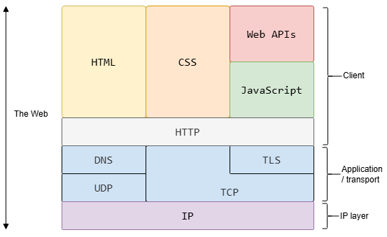
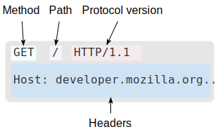

# <span style="color:orange"><center> Spring 0 </span>
## <font color="orange">Funcionamiento de una web</font> <br>


### Clientes <br>
Dispositivos de los usuarios conectados a internet con el software necesario para ello(navegador).<br>

### Servidores <br>
Computadores que almacenan páginas web, aplicaciones o sitios. <br>
Cuando el cliente accede a una página web se está descargando una copia de la página que visualiza mediante el navegador.<br>

### Agentes necesarios para la comunicación entre ``clientes y servidores:``<br>

+ __Conexión a Internet:__ permite enviar y recibir datos en la web. <br>

+ __TCP/IP(Protocolo de Control de Transmisión / Protocolo de Internet):__ Protocolos de comunicación que definen cómo deben viajar los datos. <br>

+ __DNS(Sistema de Nombres de Dominio):__ libreta de direcciones de sitios web. Direcciones de la página web buscada por el navegador que describen el servidor en el que se encuentra y su lugar en este para que el navegador pueda enviar los mensajes HTTP al lugar correcto. <br>

+ __HTTP(Protocolo de Transferencia de Hipertexto):__ Protocolo de Aplicación para definir un lenguage de comunicación entre Servidor y cliente. <br>

+ __Archivos componentes:__ Archivos que componen una web.  
  + ``` Archivos de código: ```construyen la web <br>
  + ``` Recursos: ``` Materiales(Imágenes,música...) <br>

### Procesos al demandar una dirección web en el navegador

1. El navegador acude al servidor DNS para encontrar la dirección real del servidor donde se aloja el sitio web.

2. El navegador envía un mensaje de petición HTTP al servidor, pidiéndole que envíe una copia de la página web para el cliente. Este mensaje y todos los datos enviados entre el cliente y el servidor, se envían a través de tu conexión a Internet usando TCP/IP.

3. Si el servidor aprueba la solicitud del cliente, enviará al cliente un mensaje ```«200 OK»```, que significa, «¡ Puedes ver ese sitio web! », y comenzará a enviar los archivos de la página web al navegador como una serie de pequeños trozos llamados paquetes de datos.

4. El navegador reúne los pequeños trozos, forma un sitio web completo y te lo muestra.

### Explicación de los DNS

Las direcciones webs reales no son secuencias que tecleas en la barra de direcciones para encontrar tus sitios webs. En realidad, se trata de secuencias de números, algo como 63.245.217.105.(```dirección IP```) y representa un lugar único en la web. Por eso se inventaron los servidores de nombres de dominio(```DNS```). Estos son servidores especiales que hacen coincidir una dirección web tecleada desde tu navegador con la dirección real del sitio web (IP).

Los sitios webs se pueden acceder directamente a través de sus direcciones IP. Puedes encontrar la dirección IP de un sitio web escribiendo su dominio en una herramienta como ```DNS lookup```.

### Explicación de los paquetes

 ```Paquetes```: formato en que los datos se envían desde el servidor al cliente. Los datos se envían a través de la web como miles de trozos pequeños, permitiendo que muchos usuarios pueden descargar la misma página web al mismo tiempo. Si los sitios web fueran enviados como grandes trozos, sólo un usuario podría descargarlos a la vez, lo que volvería a la web muy ineficiente.

 ## <font color="orange">¿Cómo funciona Internet?</font>

 Internet es la infraestructura técnica que hace posible la Web, mediante una gran red de computadoras que se comunican simultáneamente.

Comenzó en la década de 1960 como un proyecto de investigación financiado por el ejercito de los EE.UU, y luego se convirtió en una infraestructura pública en la década de 1980 con el apoyo de muchas universidades públicas y empresas privadas.

Internet es una forma de conectar las computadoras entre sí y asegurar que, pase lo que pase, encuentren una manera de mantenerse conectadas.

### La red

Vinculaciones para la comunicación entre ordenadores:
+ físicamente (por lo general con un cable de Ethernet)
+ inalámbrica (por ejemplo por WiFi o sistema de Bluetooth).

Una red no se limita a dos ordenadores, se pueden conectar tantos como se desee.  
La conexión por cable de todos ellos se volvería muy compleja. Por ello 
cada ordenador en una red está conectado a una pequeña computadora especial llamada enrutador(```router```).  
El router se encarga de asegurar que el mensaje enviado desde un ordenador emisor llegue al destino correcto.

ordenador -> A router -> ordenador B  

### Red de redes

Conectando ordenadores a enrutadores y luego enrutadores entre sí, podemos escalar infinitamente.
La infraestructura telefónica conecta tu casa con cualquier persona en el mundo, así que conectamos nuestra red a la infraestructura telefónica, mediante un equipo especial llamado ```modem```que convierte la información de nuestra red en información manejable por la infraestructura telefónica y viceversa.

A su vez conectaremos el modem a un proveedor de servicios de internet (```ISP``` de sus siglas en inglés ```Internet Service Provider```). Un ISP es una empresa que gestiona algunos enrutadores especiales interconectados, que también pueden acceder a enrutadores de otros ISP. Así, el mensaje de nuestra red es llevada a través de la red de redes de ISP, hasta la red de destino. Internet consiste en toda esta infraestructura de redes.

Ordenadores <-> router <-> modem <-> ISP <-> ISP <-> modem <-> router <-> Ordenadores

### Identificación de ordenadores

```Dirección IP```(Internet Protocol, o Protocolo de Internet): dirección única que identifica a un ordenador compuesta por una serie de cuatro números separados por puntos (192.168.2.10). 

Para enviar un mensaje a una computadora, se debe especificar a cuál. Por ello todo ordenador conectado a una red cuenta con una IP.

Para convertir esta serie numérica en algo que podamos asociar con mayor facilidad se utilizan los ```nombres de dominio```.

### Internet y la web

Internet es una infraestructura técnica que permite que miles de millones de ordenadores estén conectadas entre sí. Algunos de estos ordenadores, llamados servidores web son capaces de enviar mensajes inteligibles a los navegadores.  
Internet es una infraestructura, mientras que la Web es un servicio construido sobre dicha infraestructura.  
Existen otros servicios soportados por Internet, como el correo electrónico e IRC.

## <font color="orange"> Front end vs Back end</font>

El front end es aquello que ven los usuarios e incluye elementos visuales, como botones, casillas de verificación, gráficos y mensajes de texto. Permite a los usuarios interactuar con la aplicación. El back-end son los datos y la infraestructura que permiten que la aplicación funcione. Almacena y procesa los datos de las aplicaciones para los usuarios.

### Funcionamiento del front end en una aplicación

El Front end hace referencia a la interfaz gráfica de usuario (```GUI```) con la que los usuarios pueden interactuar de forma directa, (menús de navegación, los elementos de diseño, los botones, las imágenes y los gráficos).  
Una página o pantalla que el usuario ve con varios componentes de la interfaz de usuario se denomina ```modelo de objetos del documento (DOM)```.

Hay tres lenguajes de computación principales que afectan a la forma en que los usuarios interactúan con el front end:

+ El lenguaje ```HTML``` define la estructura del front end y los diferentes elementos del DOM
+ Las hojas de estilo en cascada (```CSS```) definen el estilo de una aplicación web, incluido el diseño, las fuentes, los colores y el estilo visual
+ ```JavaScript``` agrega una capa de funcionalidad dinámica mediante la manipulación del DOM

JavaScript puede activar cambios en una página y mostrar información nueva.  
Esto significa que el front end puede gestionar las interacciones (o solicitudes) fundamentales de los usuarios y transmite las solicitudes más complejas al back end.

### Funcionamiento del backend en una aplicación

A veces denominado servidor, el back end de la aplicación administra la funcionalidad general de la aplicación web. Cuando el usuario interactúa con el front end, la interacción envía una solicitud al back end en formato HTTP. El backend procesa la solicitud y devuelve una respuesta.

Cuando el backend procesa una solicitud, normalmente interactúa con los siguiente elementos:

+ ```Servidores de bases de datos``` para recuperar o modificar datos relevantes
+ ```Microservicios``` que realizan un subconjunto de las tareas solicitadas por el usuario
+ ```API de terceros``` para recopilar información adicional o realizar funciones adicionales

El backend:  
 + Utiliza varios protocolos y tecnologías de comunicación para completar una solicitud.  
 + Gestiona miles de solicitudes distintas de forma simultánea.  
 + Combina técnicas de concurrencia y paralelismo, como la distribución de solicitudes en muchos servidores, el almacenamiento en caché y la duplicación de datos.

el front end y el back end de la aplicación deben diseñarse de forma coherente para obtener los mejores resultados.

### Diferencias entre back end y front end 

__Objetivos de desarrollo:__

```full stack```: crear aplicaciones con buena capacidad de respuesta, eficientes y funcionales

```Front end```: desarrollar interfaces de usuario(GUI) con una interacción sencilla para el usuario, optimizar la aplicación en cuanto a accesibilidad y rendimiento, y crear diseños con capacidad de respuesta en diferentes plataformas y dispositivos.

```Back end```: crear y mantener las operaciones del lado del servidor de una aplicación con una arquitectura fiable y eficiente, cumpliendo con los requisitos de los usuarios, seguridad y costos.

__Tecnologías:__  

```Front end```: HTML, CSS, JavaScript, TypeScript y Marcos de trabajo (Frameworks).
```Back end```: Java, Python, Ruby, PHP y tecnologías de almacenamiento y de API.

__Simultaniedad:__

O ```concurrencia```: capacidad de una aplicación para ejecutar varias tareas de manera simultánea.

```Front end```: cada usuario tiene su propia copia de la aplicación en el navegador así que no hay problemas de concurrencia.  
```Back end```: es usual que se gestionen muchas peticiones de forma simultánea, por ello se usan diversas _estratégias_:
+ Subprocesos múltiples (gestión del procesamiento de tareas, CPU).
+ Programación asíncrona (devolución de llamadas y promesas).
+ Programación basada en eventos (escuchas de eventos y ejecuciónes de controladores de eventos de forma simultánea).
+ Bloqueo y sincronización (acceso sin inconsistencias al mismo recurso para varios usuarios de forma simultánea).

__Almacenamiento en Caché:__

Mejora el rendimiento y el tiempo de carga de una aplicación.

```Front end```: Los navegadores o las aplicaciones cliente almacenan en caché los archivos de la aplicación y los utilizan para mejorar el rendimiento.  
```Back end```: almacenamiento en caché en diferentes servidores o en una CDN (red de entrega de contenido) de diferentes contenidos para reducir la carga en el servidor.

__Seguridad:__  

```Front end```: validación de entradas en formularios, scripts en la parte del cliente y autentificación de usuario.  
```Back end```: protección de bases de datos, servicios de back end y la aplicación. (Mediante el uso de cifrado, sistemas de autenticación seguros y prácticas de codificación segura).

## <font color="orange"> Generalidades del protocolo HTTP</font>

Hypertext Transfer Protocol: protocolo que permite hacer peticiones de datos y recursos.

Es la base de cualquier intercambio de datos en la Web, y un protocolo de estructura cliente-servidor.

Clientes y servidores se comunican intercambiando mensajes individuales (no flujos continuos de datos).

Tipos de mensaje:

+ ```Peticiones```  mensajes que envía el cliente, normalmente un navegador Web.
+ ```Respuestas``` mensajes enviados por el servidor.

Se conoce como un protocolo de la capa de aplicación, y se transmite sobre el protocolo ```TCP/IP```, o el protocolo encriptado ```TLS```, teóricamente podría usarse cualquier otro protocolo fiable. Es un protocolo __ampliable__.

Se usa para:
+ Transmitir documentos de hipertexto (HTML).
+ Transmitir imágenes o vídeos.
+ Enviar datos o contenido a los servidores, como en el caso de los formularios de datos.
+ Transmitir partes de documentos, y actualizar páginas Web en el acto.



### Arquitectura de los sistemas basados en HTTP

Arquitectura en capas de la Web basado en el principio de cliente-servidor.

+ El cliente envía una petición mediante el ```agente del usuario```(normalmente un navegador web, también puede ser otro programa que explore la web).

+ Cada petición individual se envía a un ```proxy```(a demás de otros agentes intermedios como routers, modems o ISP).

+ Los proxies envian las peticiones a los ```servidores``` correspondientes para que estos las gestionen y respondan.

__Proceso para mostrar una página Web__:   
El navegador envía una petición de documento HTML al servidor, procesa este documento y envía más peticiones para solicitar scripts, hojas de estilo (CSS), y otros datos que necesite (vídeos, imágenes...). El navegador, une todos estos documentos y datos, y compone la página Web.

__Proxies__:  
Existen distintos dispositivos que gestionan los mensajes HTTP.La mayoria solamente gestionan estos mensajes en los niveles de protocolo inferiores: capa de transporte, capa de red o capa física.  
Los proxies, en canvío, son dispositivos que operan procesando la capa de aplicación.

### HTTP y conexiones

HTTP _no necesita_ que el protocolo que lo sustenta mantenga una _conexión continua_ entre los participantes en la comunicación, solamente necesita que sea un protocolo fiable o que no pierda mensajes, un protocolo que sea capaz de detectar que se ha pedido un mensaje y reporte un error.

De los dos protocolos más comunes en Internet, TCP es fiable, UDP no lo es. Por lo tanto HTTP, se apoya en el uso del protocolo TCP.

### ¿Qué se puede controlar con HTTP?

Elementos que se pueden controlar con el protocolo HTTP:

+ ```Cache```: El como se almacenan los documentos en la caché. El servidor puede indicar a los proxies y clientes que almacenar y durante cuanto tiempo.

+ ```Flexibilidad del requisito de origen``` entre cliente y servidor: Para dar facilidades al servidor, ya que los navegadores Web sólo permiten compartir datos a páginas del mismo origen para proteger la privacidad de los usuarios. 
+ ```Autentificación```: HTTP provee de servicios básicos de autentificación. Para dar acceso sólo a usuarios autorizados.
+ ```Proxies y tunneling```: Servidores y/o clientes pueden usar intranets para esconder su dirección IP. Las peticiones HTTP utilizan los proxies para acceder a ellos.

### Flujo de HTTP

__Pasos:__

1. Abre una conexión TCP.
2. Hacer una petición HTTP.
3. Leer la respuesta enviada por el servidor.
4. Cierre o reuso de la conexión para futuras peticiones.

### Mensajes HTTP

__Peticiones__:

  

+ Un ```método HTTP```, normalmente un verbo, como: GET, POST o un nombre como: OPTIONS o HEAD, que defina la operación que el cliente quiera realizar. El cliente suele hacer una petición de recursos, usando GET, o presentar un valor de un formulario HTML, usando POST. También se pueden hacer otros tipos de peticiones.
+ La ```versión``` del protocolo HTTP.
+ La ```dirección del recurso pedido```; la URL del recurso, sin los elementos obvios por el contexto, como pueden ser: sin el protocolo (http://), el dominio (aquí developer.mozilla.org), o el puerto TCP (aquí el 80).
+ ```Cabeceras HTTP``` opcionales, que pueden aportar información adicional a los servidores.
+ O un ```cuerpo de mensaje```, en algún método, como puede ser POST, en el cual envía la información para el servidor.

__Respuestas:__


+ La ```versión``` del protocolo HTTP que están usando.
+ Un ```código de estado```, indicando si la petición ha sido exitosa, o no, y debido a que.
+ Un ```mensaje de estado```, una breve descripción del código de estado.
+ ```Cabeceras HTTP```, como las de las peticiones.
+ Opcionalmente, el ```recurso que se ha pedido```.

## <font color="orange"> Renderización en la Web</font>

La renderización web es el proceso técnico mediante el cual el navegador interpreta y traduce el código de una página(HTML, CSS y JavaScript) en la representación visual e interactiva que el usuario ve en pantalla. 

[arimetrics.com](https://www.arimetrics.com/glosario-digital/renderizado-web#:~:text=Definici%C3%B3n:,cliente%20como%20el%20c%C3%B3digo%20JavaScript.)

### Fases clave del proceso de renderizado:

+ ```Análisis HTML```: Obtención y conversión del código HTML en el DOM (estructura).
+ ```Análisis CSS```: CSSOM (estilos).
+ Creación del ```Render Tree```: Unión de DOM y CSSOM para determinar qué se muestra.
+ ```Diseño``` (Layout): Cálculo de la posición y tamaño de cada elemento.
+ ```Pintura``` (Painting): Relleno de píxeles, colores, imágenes y textos en pantalla. 

[publisuites.com](https://www.publisuites.com/blog/que-es-el-renderizado-de-paginas-web/)

Tipos principales de renderización:

Renderizado del lado del servidor (SSR): El servidor genera el HTML completo y lo envía al navegador.
Renderizado del lado del cliente (CSR): El navegador descarga un HTML mínimo y usa JavaScript para construir el contenido.

Renderización del servidor (SSR)
Renderizar una app en el servidor para enviar HTML, en lugar de JavaScript, al cliente.
Renderización del cliente (CSR)
Renderizar una app en un navegador con JavaScript para modificar el DOM.
Renderización previa
Ejecutar una aplicación del cliente en el momento de la compilación para capturar su estado inicial como HTML estático. Ten en cuenta que la "renderización previa" en este sentido es diferente de la renderización previa del navegador de navegaciones futuras.
Hidratación
Ejecutar secuencias de comandos del cliente para agregar estado de la aplicación e interactividad al HTML renderizado por el servidor. La hidratación supone que el DOM no cambia.
Rehidratación
Si bien a menudo se usa para significar lo mismo que la hidratación, la rehidratación implica actualizar el DOM con regularidad con el estado más reciente, incluso después de la hidratación inicial
Rendimiento
Time to First Byte (TTFB)
Es el tiempo que transcurre entre hacer clic en un vínculo y la carga del primer byte de contenido en la página nueva.
First Contentful Paint (FCP)
Es el momento en que el contenido solicitado (cuerpo del artículo, etcétera) se vuelve visible.
Interaction to Next Paint (INP)
Es una métrica representativa que evalúa si una página responde de forma coherente y rápida a las entradas del usuario.
Total Blocking Time (TBT)
Es una métrica proxy para INP que calcula cuánto tiempo se bloqueó el subproceso principal durante la carga de la página.
